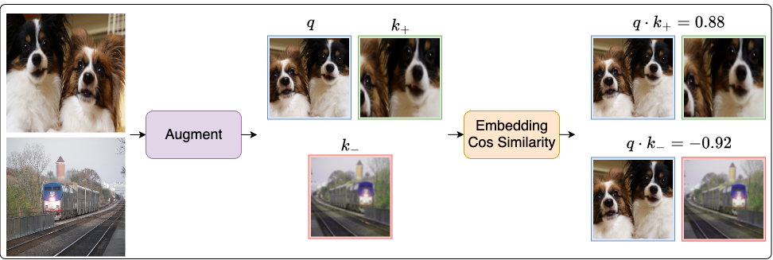

# MoCo from scratch
<div style="display: flex; gap: 5px;">
    <a href="https://youtube.com/video/PLXJQPawL5E/"></a>
    <a href="https://minimal-debug.github.io/papers/papers/moco/"></a>
    <a href="https://arxiv.org/abs/1911.05722"></a>
</div>

###
Implementing ["Momentum Contrast for Unsupervised Visual Representation Learning"](https://openaccess.thecvf.com/content_CVPR_2020/papers/He_Momentum_Contrast_for_Unsupervised_Visual_Representation_Learning_CVPR_2020_paper.pdf) CVPR 2020 from scratch.

### Clone and install dependencies
``` 
git clone https://github.com/aldipiroli/moco_from_scratch
pip install -r requirements.txt 
``` 
### Train 
``` 
python train.py moco/config/moco_config.yaml
```
### Evaluate 
``` 
python evaluate.py moco/config/moco_config.yaml path/to/ckpt.pt
```
### Qualitvative Results
> Qualitative results of cosine similarity scores for feature embeddings from the VOC dataset validation split, with the model trained for 10 epochs. 
> 


---
> Note: This repository is for educational purposes and does not aim to replicate the performance of the [original implementation](https://github.com/facebookresearch/moco). 